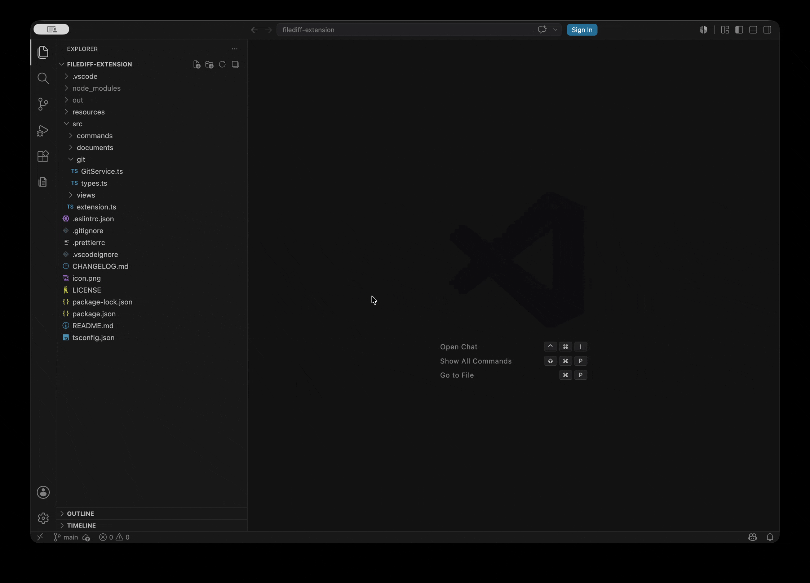

  

# Git File History List

View the current file's history in a dedicated sidebar. Open diffs directly from the commit list.

## Features

- View the current file's commit history from a sidebar list.
- Keep the commit list scoped to the active file.
- Per-commit file diff using VS Code's built-in diff editor.
- Support for added, modified, deleted, renamed, and copied file statuses.
- Commit actions for hashes and messages.

## Demo

## Usage

1. Open a file inside a Git repository.
2. Open the File History view from the Activity Bar.
3. Select a commit to open the file diff for that commit.
4. Open the context menu on a commit for hash and message actions.

## Requirements

- Git must be installed and available on PATH.
- The active file must be inside a Git repository.

## Known Limitations

- Text files are the primary target.
- Binary file contents are shown as unsupported.
- Merge commits are compared against the first parent.
